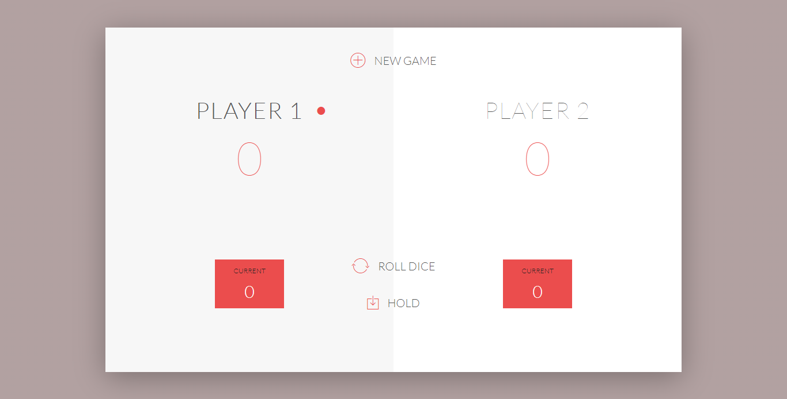

<h1 align="center">
  <br>
    Roll Dice
  <br>
</h1>

<h4 align="center">This project is about a dice roll game built using pure javascript. This is a two players game in which they roll dice and hold their score if one gets 0 on dice he'll lose all his hold score and turn will change of them reached a total of 100 he wins.
</h4>
</br>


</br>

<p align="center">
  <a href="#key-features">Key Features</a> •
  <a href="#how-to-use">How To Use</a> •
  <a href="#credits">Credits</a> •
  <a href="#related">Related</a> •
  <a href="#license">License</a>
</p>

<p align="center">
    
</p>

## Live version

https://tashfeenrao.github.io/roll-dice/

### Key Features

* User can roll dice
* User can hold score
* User can win by reaching 100 score first

## Related 
* Html
* CSS (Meterilize)
* JavaScript

## External library 

* Webpack
* css-loader
* sass-loader
* file-loader


## How To Use 
Clone this repo (you need Node js installed in your computer).
```
$ https://github.com/TashfeenRao/roll-dice.git
```

 Change to the app directory 
 
 ```
$ cd roll-dice
 ```

   And run 

```
$ npm install 
```

To start the server you don't need other special server you can go to the project folder and click the index.html or install live server extention if you're using Vscode

## Credits

This software uses the following open source packages:

- [React](https://React.org/)
- [Node.js](https://nodejs.org/)
- [Webpack](https://webpack.js.org/)
- [Babel](https://babeljs.io/)
- [Jest](https://jestjs.io/)
- [Microverse](http://microverse.org/)
- [Odin Project](https://www.theodinproject.com/)

## License

MIT

## Author
---
Porfolio [Tashfeen Rao](https://tashfeen-rao.netlify.app/) &nbsp;&middot;&nbsp;
</br>
Email: tashfeendev@gmail.com &nbsp;&middot;&nbsp;
</br>
AngelList [TashfeenRao](https://angel.co/u/tashfeen-rao) &nbsp;&middot;&nbsp;
</br>
LinkedIn [Tashfeen Rao](https://www.linkedin.com/in/tashfeen-rao/) &nbsp;&middot;&nbsp;
</br>
Twitter [@TashfeenDev](https://twitter.com/TashfeenDev) &nbsp;&middot;&nbsp; 
